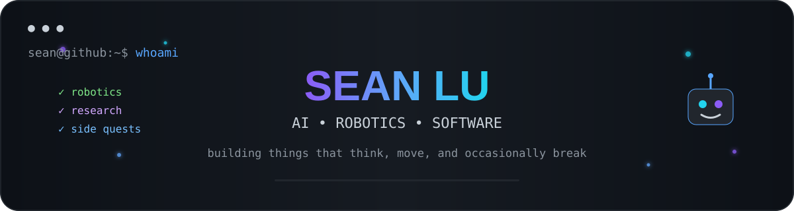

<div align="center">



<br/>

[](https://git.io/typing-svg)


[](https://www.linkedin.com/in/seanlu0903/)

</div>

---

## 🛰️ sean.exe

```text
status      : building + learning
location    : penn state
main quest  : embodied AI / robotics / software
side quest  : making my github less boring
headphones  : probably on
caffeine    : ███████░░░
```

---

## 🌱 currently

- 🤖 working on **embodied AI + robotics research**
- 🎧 building **Jarvis.io**, an AirPods-first personal AI assistant
- 🧠 exploring machine learning, intelligent systems, and AI safety
- 🎓 studying **Computer Science @ Penn State**

---

## 🎓 school

<div align="center">


### The Pennsylvania State University
**B.S. Computer Science · Class of 2027**

[](https://www.psu.edu/)

<sub>University Park, Pennsylvania</sub>

</div>

---

## ✨ things i've built

<table>
<tr>
<td width="50%" valign="top">

### 🤖 Trace2Contract
Runtime safety and contract synthesis for embodied AI systems.

`AI` `Robotics` `Research`

</td>
<td width="50%" valign="top">

### 🎧 Jarvis.io
An AirPods-first personal AI assistant for iPhone.

`AI` `iOS` `Personal Assistant`

</td>
</tr>
<tr>
<td width="50%" valign="top">

### 🛠️ Capstone
A hardware + software system built around Raspberry Pi.

`Embedded Systems` `Hardware` `Software`

</td>
<td width="50%" valign="top">

### 🧪 more coming...
I like building things at the intersection of software, AI, and the physical world.

`experiments` `ideas` `things`

</td>
</tr>
</table>

---

## 🧠 skills

<table>
<tr>
<td width="50%" valign="top">

### 🤖 AI / Machine Learning
`PyTorch` `LLMs` `LLM Agents` `RAG` `NLP` `Computer Vision` `Multimodal AI` `Reinforcement Learning` `GRPO` `Code-as-Policy` `Prompting` `Model Evaluation`

</td>
<td width="50%" valign="top">

### 🦾 Robotics / Embodied AI
`ROS2` `Isaac Sim` `Isaac Lab` `Robosuite` `RoboCasa` `cuRobo` `Robot Learning` `Runtime Verification` `Failure Recovery` `Robot Trace Analysis` `Contract Synthesis`

</td>
</tr>
<tr>
<td width="50%" valign="top">

### 💻 Programming
`Python` `C++` `C` `Java` `JavaScript` `SQL` `HTML` `CSS` `R` `SAS`

</td>
<td width="50%" valign="top">

### ⚙️ Software / Infrastructure
`Linux` `Git` `Docker` `FastAPI` `Pytest` `Ray` `AWS` `Weights & Biases` `Bazel` `REST APIs` `Experiment Orchestration` `Reproducible Evaluation`

</td>
</tr>
<tr>
<td width="50%" valign="top">

### 🔬 Research / Evaluation
`Experimental Design` `Benchmarking` `Failure Analysis` `Deterministic Validation` `Large-Scale Trial Analysis` `Execution Traces` `Reproducibility` `Technical Writing`

</td>
<td width="50%" valign="top">

### 🛠️ Systems / Dev Tools
`VS Code` `GitHub` `GPU ML Workflows` `Backend Development` `Testing Infrastructure` `Debugging` `API Integration` `Raspberry Pi`

</td>
</tr>
</table>

<div align="center">


</div>

---

## 🐣 tiny sean facts

```text
🤖 likes robots
🎧 probably wearing airpods
☕ converting caffeine into code
🧠 thinks "what if I built..." far too often
🐛 creates bugs → fixes bugs → creates cooler bugs
🎮 occasionally disappears into ranked mode
```

---

## 🎮 side quests

<table>
<tr>
<td width="50%" valign="top">

###  VALORANT
**Peak Rank:** Diamond 3

`competitive fps` `D3 peak`

</td>
<td width="50%" valign="top">

###  League of Legends: Wild Rift
**Peak Rank:** Challenger  
🏆 Former competitive player  
☁️ Beat the **Cloud9 Wild Rift team**

`challenger` `competitive`

</td>
</tr>
<tr>
<td width="50%" valign="top">

###  Delta Force
**Highest Rank:** Field Marshal  
💀 **Most Kills in One Match:** 197

`field marshal` `197 kills`

</td>
<td width="50%" valign="top">

###  Marvel Rivals
**Peak Rank:** Grandmaster — Season 0  
🐈‍⬛ **Black Panther main**

`grandmaster` `BP main`

</td>
</tr>
</table>

<div align="center">

<br/>


</div>
